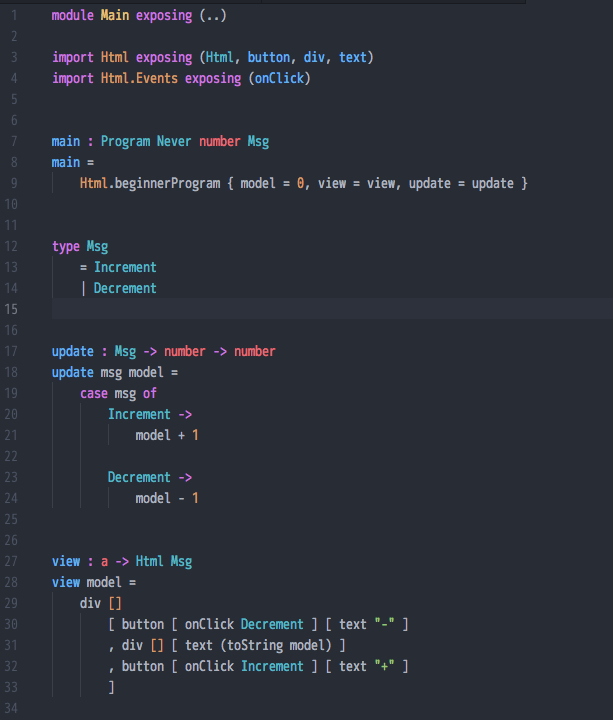

# language-elm package

Syntax highlighting for the [Elm language](http://elm-lang.org/), 0.18+.

## Fork note

This is a fork repository of [edubkendo/atom-elm](https://github.com/edubkendo/atom-elm), for Elm 0.18+.

Some refinements are applied:

- Removal of now-defunct syntactical keywords
- Revising color schema, influenced by [language-elixir]
- More consistent color-application.
  Especially, not differentiating functions from official packages and ones from third-parties.
    - Also see discussion [here](https://discourse.elm-lang.org/t/syntax-highlighting-for-core-types/668)
- Removal of [elm-oracle] integration, since [elm-oracle] itself is not actively updated for 0.17+
    - For Atom users I **strongly** recommend using [elmjutsu] for now

[language-elixir]: https://github.com/elixir-editors/language-elixir
[elm-oracle]: https://github.com/ElmCast/elm-oracle
[elmjutsu]: https://github.com/halohalospecial/atom-elmjutsu

Original `atom-elm` repository is stale for some time, so contributions are welcomed.

## How It Looks

(Atom 1.24.0, with One Dark theme/syntax)

## Installation

- `apm install ymtszw/language-elm`

## Jump to Symbol

Atom's native `symbols-view` package uses `ctags`, and thus doesn't support Elm without extra configuration.
But [goto](https://atom.io/packages/goto) package uses langauge definition files to identify symbols,
and does support Elm as long as language-elm is installed. (Not tested after fork, though)

If you prefer `ctags` and default `symbols-view`,
[kbsymanz/ctags-elm](https://github.com/kbsymanz/ctags-elm) configuration may help.
